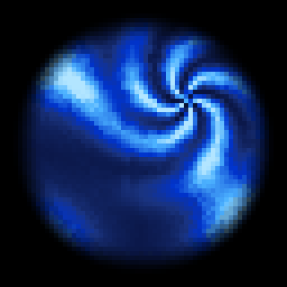

# cttimegate

A WebGL2 recreation of the Chrono Trigger time gate sprite effect, written as a Shadertoy-style GLSL fragment shader. The shader procedurally renders a pixelated blue portal with a spinning vortex and bands of light flowing into it.



`timegate.png` is the reference SNES sprite the shader is targeting.

## Files

- **`timegate.glsl`** — the fragment shader. Uses the standard Shadertoy `mainImage(out vec4 o, in vec2 f)` signature and reads `iResolution`, `iTime`.
- **`index.html`** — a minimal WebGL2 harness. Sets up a fullscreen canvas, fetches `timegate.glsl`, wraps it with the Shadertoy uniforms and a fullscreen-triangle vertex shader, and runs the render loop. Compile/link errors are shown as a red overlay.
- **`serve.py`** — a stdlib-only local HTTP server. Disables caching so edits to `timegate.glsl` show up on browser refresh. Binds to `127.0.0.1` only.
- **`capture.py`** — offscreen renderer (moderngl + Pillow) that writes `timegate.gif`. Use this to refresh the README preview after shader changes.
- **`requirements.txt`** — `moderngl` + `Pillow` for `capture.py`. The dev server has no external dependencies.
- **`installdeps`** — convenience script for the `mise` + `uv` toolchain.

## Running

A local server is required because `index.html` uses `fetch()` to load the shader, which won't work over `file://`.

```sh
python3 serve.py            # default port 8000
python3 serve.py 8001       # alternate port if 8000 is taken
```

Then open <http://localhost:8000> in a browser.

## Regenerating the preview GIF

```sh
./installdeps                  # one-time: install moderngl + Pillow
python3 capture.py             # writes timegate.gif (320x320, 4s, 20fps)
python3 capture.py 480 480 5 24   # custom: width, height, seconds, fps
```

The renderer compiles `timegate.glsl` into a desktop-OpenGL context (no browser needed), records frames offscreen, and writes a single-palette GIF for stable colors across the loop.

## Iterating on the shader

1. Edit `timegate.glsl`.
2. Save.
3. Refresh the browser tab — the server returns a fresh copy each time (no caching).

If the shader fails to compile or link, the page shows the GLSL error log as a red overlay on top of the canvas. Common gotchas:

- Variable name collisions with the existing local `d` (disc radius) inside `mainImage`.
- The shader is wrapped in a `#version 300 es` envelope — uniforms (`iResolution`, `iTime`, `iMouse`, `iFrame`, `iTimeDelta`) are predeclared by the harness, so don't re-declare them in the user shader.

## How the shader is structured

`mainImage` builds the gate in three layers:

1. **Pixelation** — fragment coordinates are quantized to integer pixel blocks sized `floor(iResolution.y / 64.)`, so the disc reads at ~64 effective pixels along its short axis at any window size.
2. **Disc mask + warps** — a circular alpha falloff (`smoothstep(.92, .7, d)`) bounds the gate, and small static domain warps add irregularity to the wave field.
3. **Pattern blend** — the pivot is offset to the upper-right; `s = length(q)` is distance from pivot. A `smoothstep(.5, 0., s)` blends:
   - **Spoke region (small `s`)** — `sin(5*a + …)` produces the spinning star/vortex.
   - **Wave region (large `s`)** — gaussian-tail bands flow into the spoke.

The two regions share the `5*a` angular structure so they merge continuously, and their time coefficients are matched so the spoke spins at the same rate as bands flow in.

The output of both is run through `m(t)`, a hand-tuned 5-stop blue-to-cyan-to-white color ramp.
